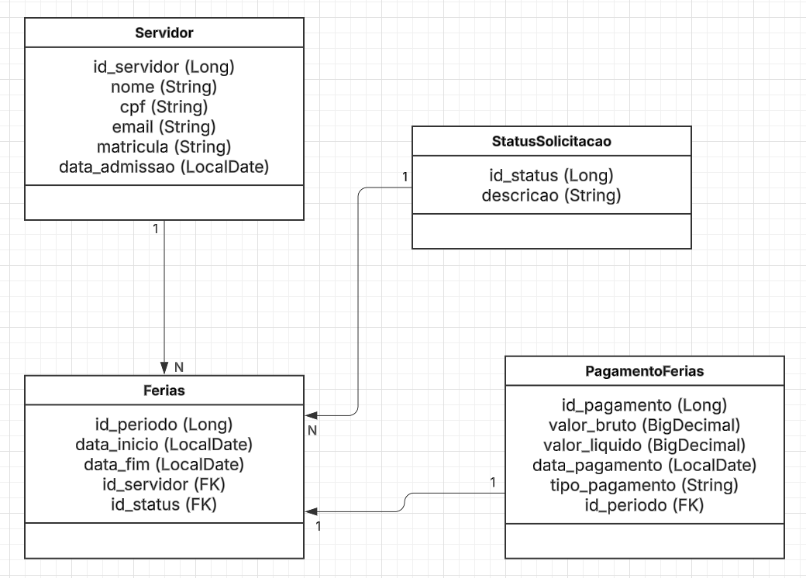
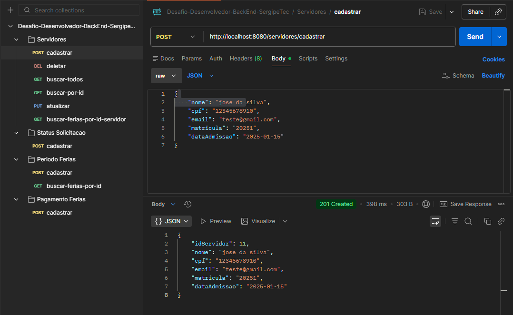
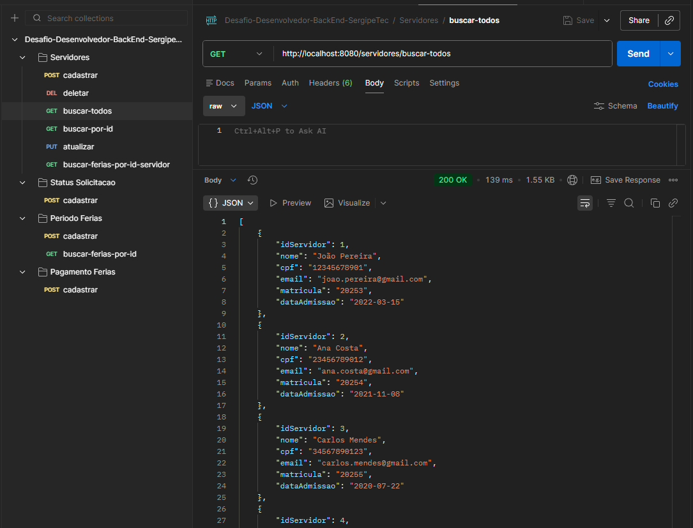
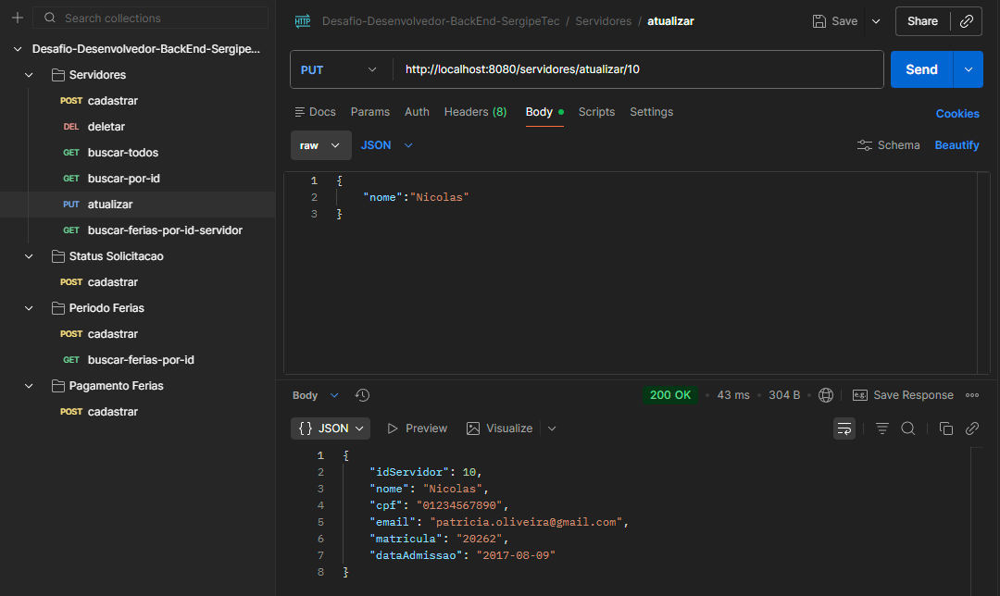
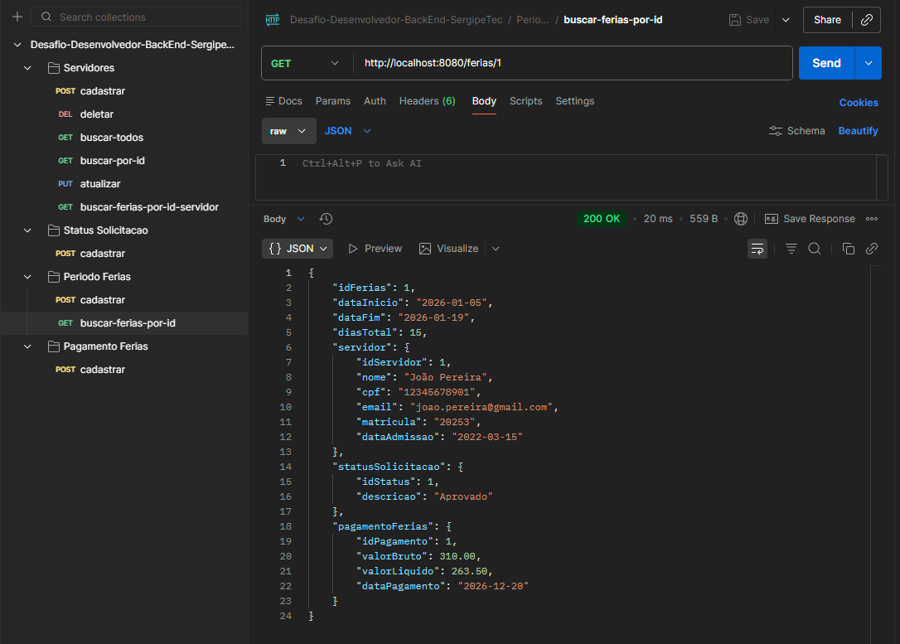
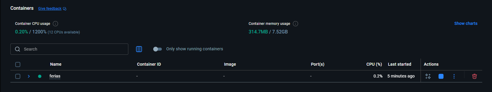
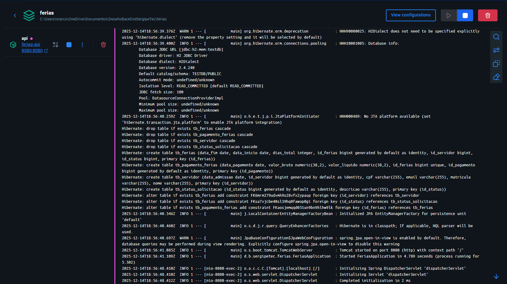

# 🏖️ API de Gestão de Férias

Este projeto é uma API REST desenvolvida em **Spring Boot** para gerenciamento de períodos de férias de servidores públicos, incluindo informações de status e pagamento.

O projeto atende ao desafio técnico proposto e está totalmente **containerizado com Docker**, utilizando **H2 em memória** como banco de dados.

---

##  Tecnologias Utilizadas

* Java 21
* Spring Boot
* Spring Data JPA
* H2 Database (em memória)
* Maven
* Docker
* Docker Compose

---

## Modelagem

### Modelagem de dados

https://lucid.app/lucidchart/0e930856-b0b1-4fef-b7ca-6e979a48e52c/edit?viewport_loc=-18%2C124%2C1674%2C793%2CHWEp-vi-RSFO&invitationId=inv_2e9efbd5-3b68-476a-a2e8-8a98a553b83c



### Protótipo de baixa fidelidade

https://excalidraw.com/#json=PnP1jQeGYsjbI_RoNCSkn,FAt9ijxevo0n_cYUdbVN1w


---


##  Configuração do Banco (H2)

O banco utilizado é o **H2 em memória**, inicializado automaticamente na subida da aplicação.

* As tabelas são criadas via JPA (`ddl-auto=create`)
* Os dados iniciais são carregados automaticamente pelo arquivo `data.sql`
* Também é possível povoar as tabelas manualmente via Postman pelos endpoints disponíveis na coleção: 
* Desafio-Desenvolvedor-BackEnd-SergipeTec.postman_collection


> ⚠️ Como o H2 é em memória, **os dados são resetados toda vez que a aplicação reinicia**.

---

##  Como executar o projeto com Docker

### ✅ Pré-requisitos

* Docker Desktop instalado e em execução
* Maven (ou IDE com suporte a Maven)

---

### Subir a aplicação com Docker Compose

Na raiz do projeto executar:

```bash
docker compose up --build
```

A API ficará disponível em:

```
http://localhost:8080
```

---

###  Parar a aplicação

Para parar os containers:

```bash
docker compose down
```

---

##  Endpoints Principais

### 🔹 Listar servidores

```http
GET /servidores
```

---

### 🔹 Listar férias de um servidor (resumido)

```http
GET /servidores/{id}/ferias
```

Retorna apenas os dados essenciais das férias:

```json
[
  {
    "dataInicio": "2026-01-05",
    "dataFim": "2026-01-19",
    "diasTotal": 15,
    "descricao": "Aprovado"
  }
]
```

---

### 🔹 Detalhar férias (com pagamento e status)

```http
GET /ferias/{id}
```

Retorna todas as informações do período de férias, incluindo servidor, status e pagamento.

---

##  Sobre o Docker

* O container utiliza a imagem `eclipse-temurin:21-jdk`
* O banco H2 roda **dentro do mesmo container da aplicação**
* Não há necessidade de container de banco externo

---

##  Observações Importantes

* O H2 Console **não é exposto no Docker**, pois o acesso aos dados deve ser feito via API
* O arquivo `data.sql` é executado automaticamente na inicialização


---

## 👨‍💻 Autor

Projeto desenvolvido como parte de um **desafio técnico backend**, com foco em organização, clareza de código e boas práticas.

---

✅ Projeto finalizado e pronto para avaliação.

## Prints do sistema
### Postman










### Docker


